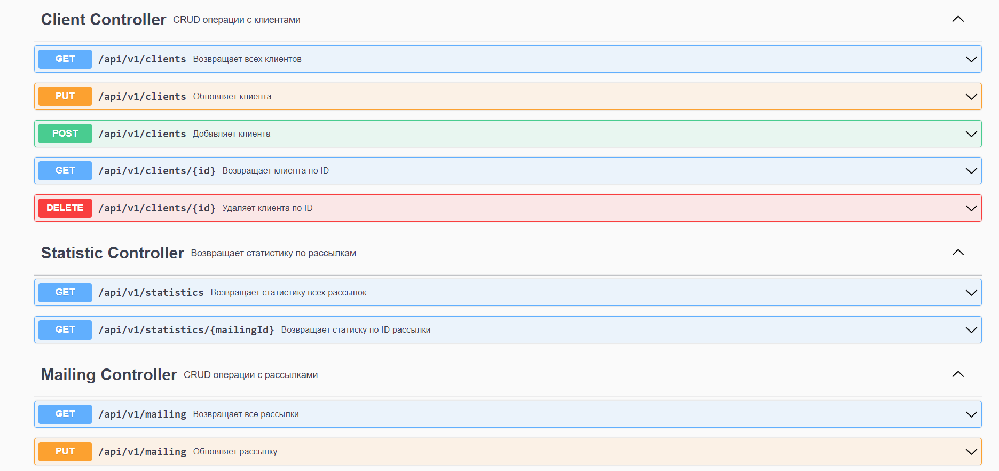
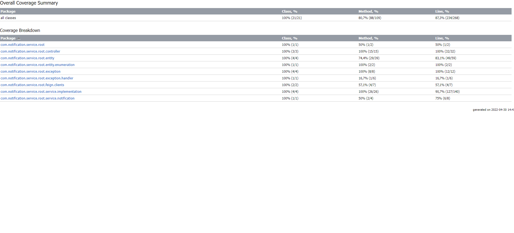

<h1 align="center">Сервис по отправке рассылок</h1>

## Для чего нужен этот сервис?

Сервис нужен для того, чтобы создавать и отправлять рассылки, добавлять клиентов в базу данных и запускать рассылки для подходящих клиентов.

Клиенты для рассылки подбираются по коду мобильного оператора. Вы можете просмотреть статистику отправленных сообщений для каждой отдельной рассылки или для всех сразу.

## Возможности

- Создание, редактирование и удаление рассылок
- Добавление, редактирование и удаление клиентов
- Автоматический запуск рассылки, если при её создании дата начала уже наступила
- Автоматически запуск рассылки в свою дату и остановка рассылки, если дата конца рассылки наступила до конца отправки всех
- Сбор статистики по отправленным сообщениям к каждой расслыке
- Запросы отправки сообщений на внешнее API (https://probe.fbrq.cloud/v1)
- SwaggerUI страница с информацией о контроллерах

## Установка приложения
- Склонируйте репозиторий `git clone https://github.com/Basnucaev/notification_service.git`
- Если у вас есть необхоимость, установите в своей операционной системе переменные среды `DB_USER`, `DB_PASSWORD` для соединения с БД и `LOG_FILE_NAME` для логирования в собственный файл
- Из корневой папки проекта выполните последовательно команды:
`./mvnw clean install`
`./mvnw spring-boot:run`
- Приложене должно быть запущено на локальном сервере `http://localhost:8080/`

## Документация по API сервиса

Вы можете получить её запустив приложение и перейдя по ссылке `http://localhost:8080/swagger-ui.html`

## Выполненные дополнительные задания:

1. Написаны тесты для всех контроллеров и сервисов. 

5. По адресу `http://localhost:8080/swagger-ui.html` открывается такая страница

9. Проблемы со стороны внешнего сервиса не должны влиять на работу внутреннего 

12. Обеспечено подробное логирование

